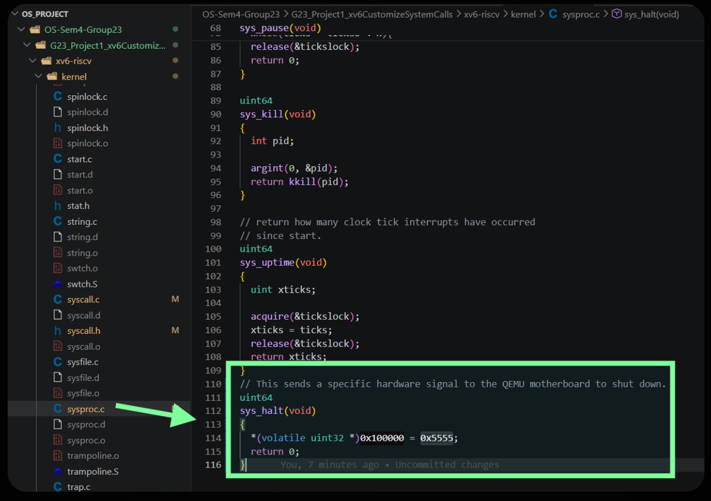
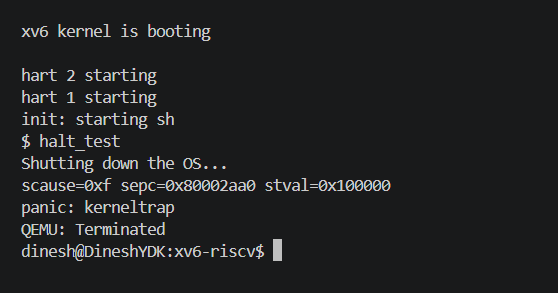
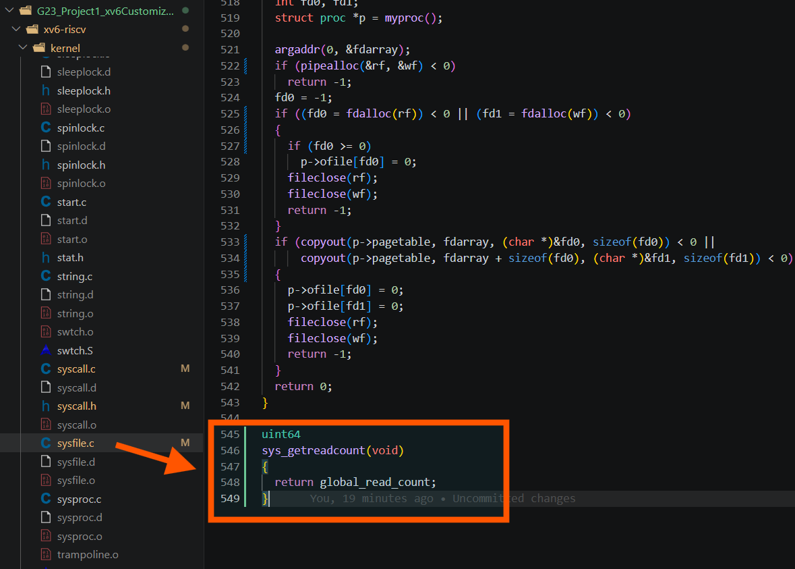
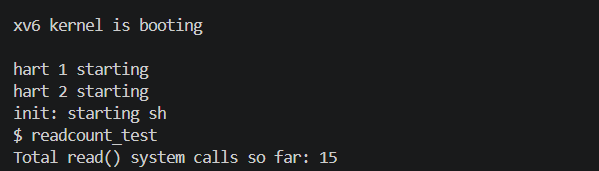
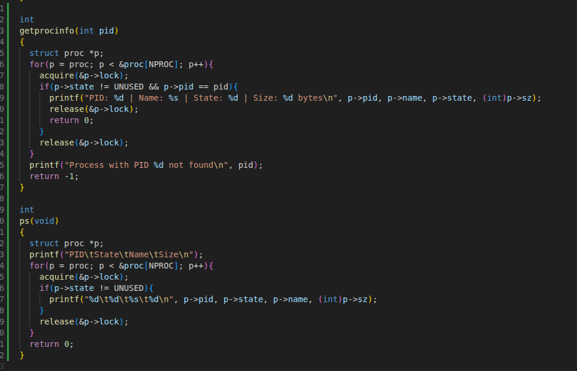
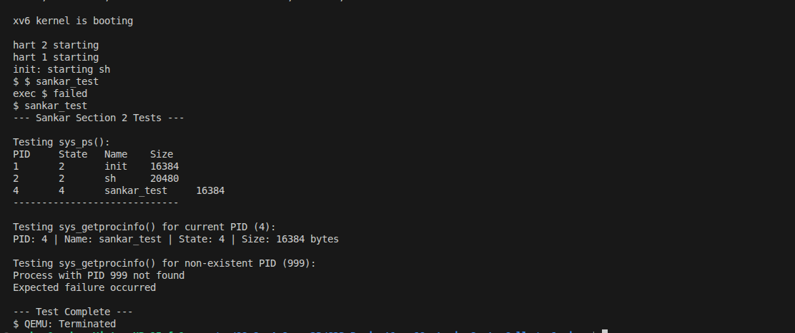

# Project 1: xv6 System Call Customization Documentation

## Overview
This document describes the custom xv6 system calls implemented by Group 23, including what each call does and how it works inside the kernel. The mapping between team members and their implemented calls is preserved, but the focus is purely technical.

---

## System Calls by Member

### Dinesh

#### 1. `sys_halt()`
- **What it does:** Shuts down the xv6 instance running in QEMU.
- **How it does it:** In `kernel/sysproc.c`, `sys_halt()` writes the value `0x5555` to the memory-mapped hardware address `0x100000`. QEMU interprets this as a power-off signal and exits.
- **Code Screenshot:**
  
- **Execution Screenshot:**
  

#### 2. `sys_getreadcount()`
- **What it does:** Returns how many times `read()` has been invoked since boot.
- **How it does it:** A global counter `global_read_count` is maintained in `kernel/sysfile.c`. Every `sys_read()` call increments this counter. `sys_getreadcount()` simply returns that counter value to user space.
- **Code Screenshot:**
  
- **Execution Screenshot:**
  

---

### Sankar

#### 3. `sys_getprocinfo(pid)`
- **What it does:** Shows details of a specific process identified by PID.
- **How it does it:** `sys_getprocinfo()` fetches the PID argument and calls `getprocinfo(pid)` in `kernel/proc.c`. The kernel scans the process table (`proc[]`), locks each entry safely, checks for matching PID, and prints details such as PID, name, state, and memory size (`sz`). If not found, it prints an error and returns `-1`.
- **Code Screenshot:**
  
- **Execution Screenshot:**
  

#### 4. `sys_ps()`
- **What it does:** Prints a process listing similar to `ps`.
- **How it does it:** `sys_ps()` calls `ps()` in `kernel/proc.c`, which iterates through the process table, acquires each process lock, skips `UNUSED` entries, and prints active process details (PID, state, name, size) in tabular format.

---

### Yash Patidar

#### 5. `sys_getfreemem()`
- **What it does:** Returns available free physical memory in bytes.
- **How it does it:** `sys_getfreemem()` calls `getfreemem()` in `kernel/kalloc.c`. That function locks the allocator (`kmem.lock`), traverses the free-list of pages, counts free pages, and returns `count * PGSIZE`.
- **Code Screenshot:**
  
- **Execution Screenshot:**
  

#### 6. `sys_getopenfiles()`
- **What it does:** Returns how many file descriptors are currently open by the running process.
- **How it does it:** `sys_getopenfiles()` calls `getopenfiles()` in `kernel/file.c`. The function gets the current process (`myproc()`), loops over `p->ofile[]`, counts non-null entries, and returns the total.
- **Code Screenshot:**
  
- **Execution Screenshot:**
  

---

### Yash Agarwal

#### 7. `sys_shm_get(key)`
- **What it does:** Creates or retrieves a shared memory page for a key and maps it into the caller process.
- **How it does it:** In `kernel/sysproc.c`, `sys_shm_get()` checks a small shared-memory table (`shm_table[8]`) under `shm_lock`. If the key already exists, it reuses the same physical page. If not, it allocates a fresh page using `kalloc()` and zero-initializes it. Then it maps that physical page into the caller's user page table at the next page-aligned virtual address using `mappages()`, updates process size (`p->sz`), and returns the mapped virtual address.
- **Execution Screenshot:**
  

#### 8. `sys_sigalarm(n, handler)` and `sys_sigreturn()`
- **What it does:** Provides periodic user-level alarm callbacks after every `n` timer ticks, then restores normal execution when the handler finishes.
- **How it does it:** `sys_sigalarm()` stores alarm interval and handler address in the current process structure and resets alarm tick state. On timer interrupts (trap path), xv6 checks these alarm fields and redirects execution to the user handler when interval is reached. After handler work is complete, `sys_sigreturn()` restores saved trapframe context so the process resumes exactly where it was interrupted.
- **Execution Screenshot:**
  

---

## Core Kernel Integration Path
All custom calls were integrated through xv6's standard syscall path:
1. Added syscall numbers in `kernel/syscall.h`.
2. Added syscall handlers in `kernel/syscall.c`.
3. Implemented logic in kernel files (`sysproc.c`, `sysfile.c`, `proc.c`, `kalloc.c`, `file.c`).
4. Exposed user wrappers via `user/usys.pl` and prototypes in `user/user.h`.
