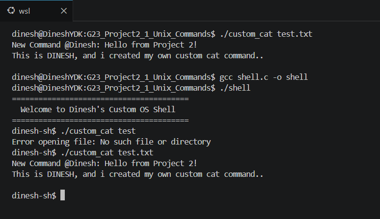
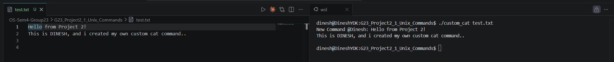
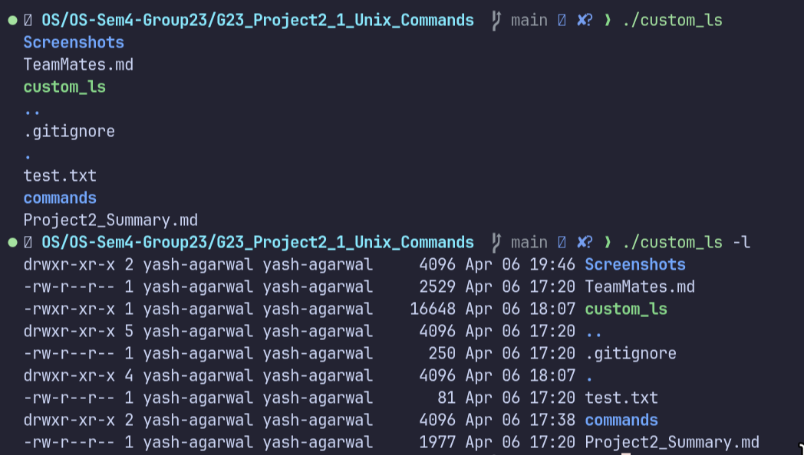
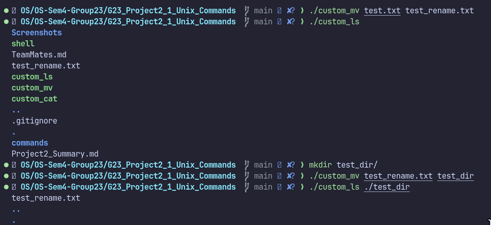
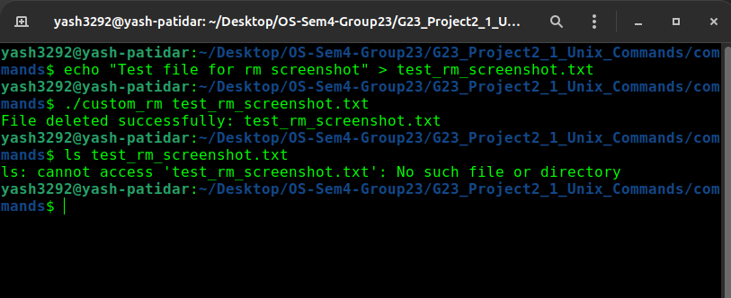

# Project 2: UNIX-like Utilities Documentation

## Overview
This document provides details on the lightweight, simplified UNIX-like utilities implemented from scratch in C for this project. To avoid confusion with standard UNIX commands, each utility has a unique name (e.g., `custom_cat` instead of `cat`). A custom main shell is also implemented to execute these utilities.

---

## Implemented Utilities

### 1. Custom Shell (`shell`) (By Dinesh)
The main UNIX-like shell program. It acts as the user interface, parsing input commands, handling arguments, and using `fork()` and `exec()` to run the custom utilities implemented in this project.
- **Source:** `commands/shell.c`
- **Execution Screenshot:**
  

### 2. Custom Cat (`custom_cat`) (By Dinesh)
Concatenates and displays file content. It opens the provided file paths, reads their contents, and outputs them to the standard output stream, mimicking the standard `cat` command.
- **Source:** `commands/custom_cat.c`
- **Execution Screenshot:**
  

### 3. Custom LS (`custom_ls`) (By Yash Agarwal)
Lists directory contents. It opens the current working directory (or a specified path), reads the directory entries, and prints the names of the files and folders contained within.
- **Source:** `commands/custom_ls.c`
- **Execution Screenshot:**
  

### 4. Custom MV (`custom_mv`) (By Yash Agarwal)
Moves or renames files and directories. It typically utilizes system calls to link the file to a new destination path and unlink the original footprint, effectively processing moving or renaming operations safely.
- **Source:** `commands/custom_mv.c`
- **Execution Screenshot:**
  

### 5. Custom Grep (`custom_grep`) (By Sankar)
Searches for patterns in files. It opens a file, reads it line-by-line, and prints only the lines that contain a specific search word.
- **Source:** `commands/custom_grep.c`
- **Execution Screenshot:**
  

### 6. Custom WC (`custom_wc`) (By Sankar)
Word, line, and character count utility. It opens a file and counts the total number of characters, words, and lines inside it.
- **Source:** `commands/custom_wc.c`
- **Execution Screenshot:**
  

### 7. Custom CP (`custom_cp`) (By Yash Patidar)
Copies files. It copies the contents of a source file into a new destination file.
- **Source:** `commands/custom_cp.c`
- **Execution Screenshot:**
  

### 8. Custom RM (`custom_rm`) (By Yash Patidar)
Removes files or directories. It uses the `unlink()` system call to permanently delete a file.
- **Source:** `commands/custom_rm.c`
- **Execution Screenshot:**
  
